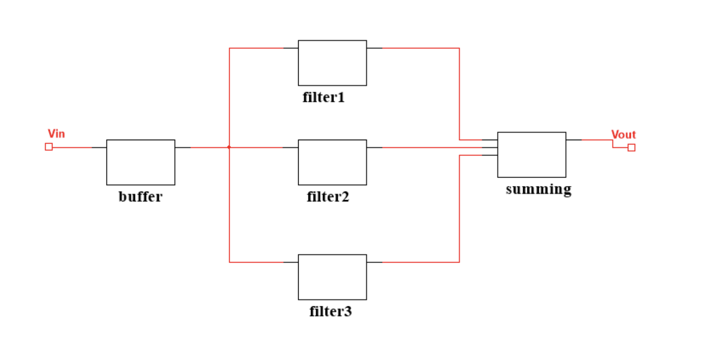
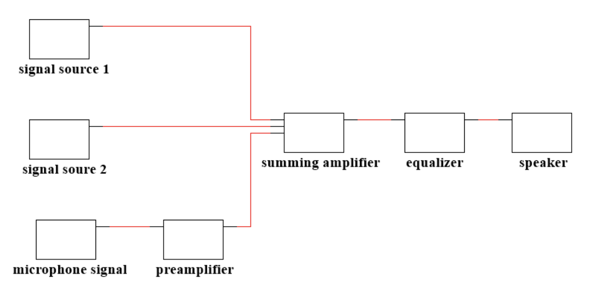
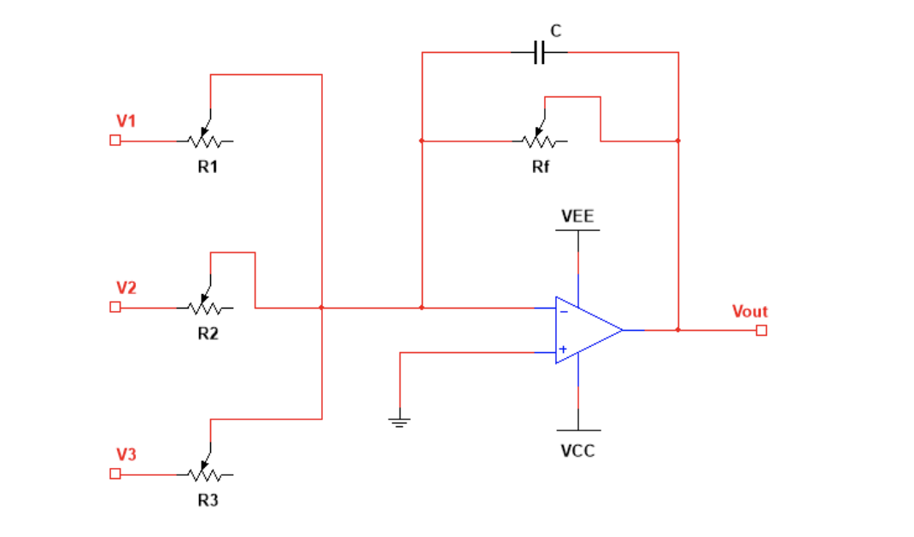
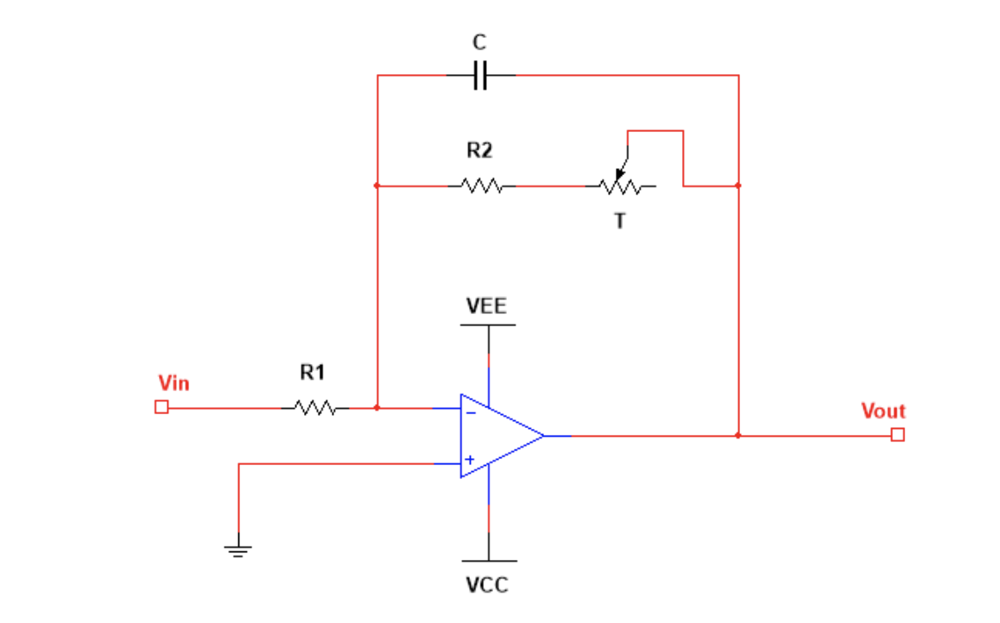
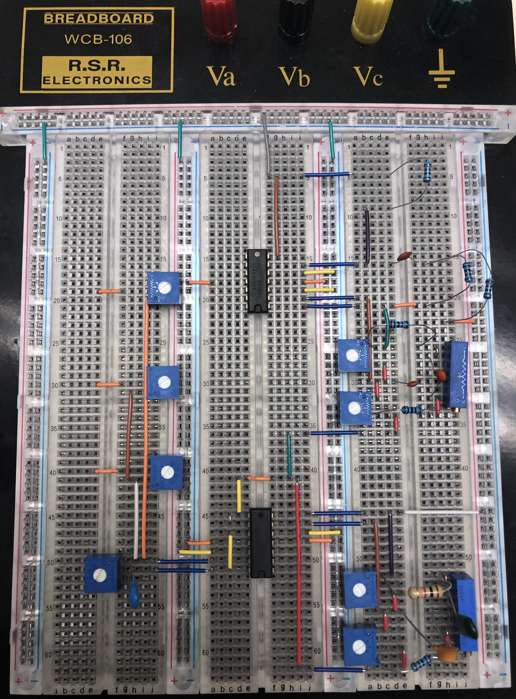

# Supplemental Material Audio Mixer

# Intro
Audio mixer, also called mixing console, is an electronic device for combining (also called “mixing”) and modifying audio signals. 
Audio mixers can be analog or digital type. Digital audio mixer use digital signal processing and analog mixers are usually 
based on operational amplifiers (opamps) electronic circuits. In this project we will build a three-
channel analog audio mixer with opamps, resistance and 
capacitance. The input audio signals can be anything from 
microphones, cell phones and computers. The mixer will be 
able to combine audio signals from different signal sources, 
change the volumes of each input channel, as well as the 
overall volume of the mixer output. Then, we are going to add more circuits for audio equalizer, which 
boost or attenuate a range of frequencies, e.g. bass, midrange, and treble, and perform general 
equalization control at the output. 

# Circuit Diagram I
The system is shown, which contains three input signals, preamplifier, summing amplifier, 
equalizer and a speaker.  

Diagram of equalizer

# Circuit Diagram II
Preamplifier

Summing Amplifier 

# Circuit

